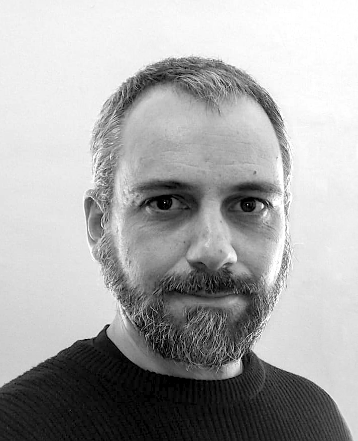

{: width="150" }

Botanist and biogeographer with a focus in long term history. I apply ecoinformatics tools on current and palaeobiological records to address broad questions about biogeography, macroecology, community-ecology, anthropization and/or climate change.